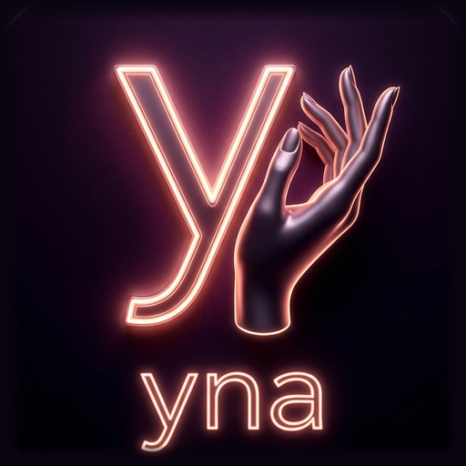

# yna (v2.0.0)

<p align="center">
  
</p>

<p align="center">
  <b>Simulador de Física Interactiva 3D Femenina para Android y PC</b><br>
  <i>Motor de física armónica suave, shaders de dispersión subsuperficial (SSS), anatomía en alta definición y UI moderna en Godot 4.7</i>
</p>

<p align="center">
  <a href="https://github.com/uamo11/yna/releases/latest"></a>
  
  
</p>

---

## 📱 Descargas

- **APK v2.0.0 para Android (arm64-v8a / armeabi-v7a)**: [Descargar desde Releases](https://github.com/uamo11/yna/releases/latest)

---

## ✨ Características Principales

### 🍑 1. Físicas Suaves e Interactivas en Tiempo Real
- **6 Sistemas de Osciladores Armónicos Amortiguados**:
  - Rebote primario no-lineal con resonancia biológica.
  - Deformación de volumen (*Squash & Stretch*) preservadora de masa.
  - Oscilación y balanceo angular tridimensional (*Wobble*).
- **Interacción Táctil Directa**:
  - Pellizco / hundimiento elástico (*poke indentation*) al tocar y arrastrar.
  - Rebote elástico por liberación (*snap-back*).
  - Transferencia elástica cruzada entre ambos glúteos (*inter-cheek cleft shear coupling*).
- **Ondas de Choque en GPU (Vertex Shader)**:
  - Deformación en ondas concéntricas propagadas por la superficie dérmica al recibir un impacto dinámico.

### 🌸 2. Modelado y Anatomía Hiperrealista (169,362 Vértices)
- **Topología Orgánica de Alta Densidad**:
  - Esculpido de hendidura interglútea profunda con compresión lateral.
  - Detalle anatómico íntimo con labios mayores, vulva y surco medio.
  - Repliegues radiales y orificio anal modelado de forma natural.
  - Pliegue infraglúteo (transición glúteo-muslo) y hoyuelos lumbares de Venus.
- **Ropa Interior 3D Física**:
  - Prendas con grosor real modeladas con modificador Solidify y dobladillo redondeado (*Bevel*).
  - 3 Modos disponibles: **Bikini Clásico**, **Tanga Sexy**, y **Sin Ropa**.

### 🌟 3. Shaders y Renderizado Dérmico Avanzado
- **Dispersión Subsuperficial (Subsurface Scattering - SSS)**:
  - Difusa Burley envuelta con banda dérmica de sangre arterial en el terminador de sombras.
  - Variación anatómica local (`sss_local`) con mayor vascularización y translucidez en zonas íntimas.
- **Micro-Poros y Especularidad Dual-Lobe**:
  - Mapeo normal tangencial de poros cutáneos.
  - Reflejo especular dual (lóbulo amplio suave + lóbulo fino de brillo cutáneo) con atenuación Fresnel.
  - Sonrojo dérmico reactivo que se acumula tras impactos y se disipa térmicamente con el tiempo.

### 🎮 4. Control Táctil y Cámara Móvil
- **Soporte Táctil Nativo de Android**:
  - Modos de interacción rápida: Modo **SLAP / TOUCH** y Modo **ROTACIÓN**.
  - Cámara orbital 3D con inercia, momentum elástico y zoom suave.
- **Panel de Ajustes Gráficos**:
  - Presets preconfigurados: *Baja*, *Media*, *Alta*, *Ultra*.
  - Configuración persistente de Anti-Aliasing (MSAA), sombras, filtros de texturas y resolución.

---

## 📂 Estructura del Proyecto

```
yna/
├── SlapSimulator/              # Proyecto Godot 4.7
│   ├── assets/
│   │   ├── models/             # character.glb (Malla 3D + Esqueleto + Pesos)
│   │   ├── textures/           # Texturas de piel y lencería
│   │   └── audio/              # Efectos de sonido SFX
│   ├── scenes/                 # Escena principal (main.tscn)
│   ├── scripts/                # Lógica GDScript (Física, Cámara, UI, Sonido)
│   ├── shaders/                # Shaders GLSL de piel y ropa
│   ├── export_presets.cfg      # Configuración de exportación Android
│   └── project.godot           # Archivo de configuración del proyecto
├── export_master_v6.py         # Pipeline maestro de esculpido y exportación en Blender
├── female_basemesh_v001.blend  # Malla base original
└── README.md
```

---

## 🛠️ Requisitos de Desarrollo

- **Godot Engine 4.7+** (Soporte Vulkan / Mobile / Compatibility)
- **Blender 5.2+** (Para el pipeline de regeneración de mallas)
- **Android SDK & Build Tools 34+** (Para compilar el APK)

---

## 📄 Licencia

Este proyecto está disponible bajo la licencia MIT. Consulta el archivo LICENSE para más detalles.
